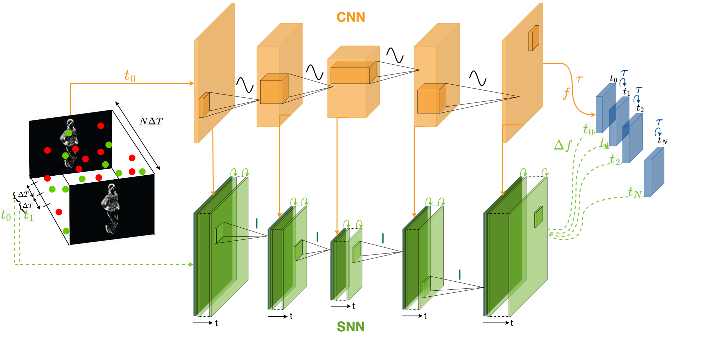

# Human pose estimation with a hybrid ANN-SNN model 

## Overview
This repository implements a hybrid CNN - SNN architecture for low rate CNN predictions with high accuracy and high-rate, energy-efficient updates with SNN predictions. 



This is the official PyTorch implementation of the CVPRW 2024 paper [A Hybrid ANN-SNN Architecture for Low-Power and Low-Latency Visual Perception](https://arxiv.org/abs/2303.14176).


## Citation
If you find this work and/or code useful, please cite our paper:

```bibtex
@InProceedings{Aydin_2024_CVPRW,
  author  = {Aydin, Asude and Gehrig, Mathias and Gehrig, Daniel and Scaramuzza, Davide},
  title   = {A Hybrid ANN-SNN Architecture for Low-Power and Low-Latency Visual Perception},
  booktitle = {Proceedings of the IEEE/CVF Conference on Computer Vision and Pattern Recognition Workshops (CVPRW)},
  year    = {2024},
}
```

## Installation

Create a new virtual environment and install the requirements.
Pytorch needs to be reinstalled to be compatible with CUDA driver.

 ```
 python3 -m venv ~/spikejelly 
 source ~/spikejelly/bin/activate 
 pip install -r requirements.txt
 ```

## Set python path

Run `export PYTHONPATH='<root_directory_of_code>'`.

## Update configuration files 

Go to `configs/build_default_config_file.py` and set `dataset_path, P_mat_path, save_root_dir, checkpoint_dir`. 
Run the python script to update deafult config files in `configs/`. 

    .
    ├── ...
    ├── configs         # Default configuration files.
    │   ├── build_default_config_file     
    │   └── ...               
    └── ...

## Training Examples

Example code for training the hybrid cnn snn model:
```
python3 train/train_cnn_snn_hybrid_model.py --config_path /data/storage/asude/code/master_thesis/configs/hybrid_cnn_snn_config.ini --device cuda:0 --output_path /data/storage/asude/code/master_thesis/exp_hybrid_cnn_snn --tb_name hybrid_cnn_snn
```

Training scripts for other models can be found in: 

    .
    ├── ...
    ├── train           # Training files 
    │   ├── 
    │   ├── train_cnn_model     
    │   ├── train_cnn_rnn_hybrid_model         
    │   ├── train_cnn_snn_hybrid_model         
    │   ├── train_rnn_model         
    │   └── train_snn_model
    └── ...
    
Parameters to be set for training are: 

```
--config_path                        # directory of configuration folder (default configurations can be found in configs folder)
--device                             # device for script to run on 
--output_path                        # directory for checkpoints to be saved in (if --save_params = True, default True)
--tb_name                            # experiment name for tensorboad (if --save_runs = True, default True)
--save_runs (Default)      
/--no_save_runs                      # saves results during training to tensorboard
--save_params (Default)     
/--no_save_params                    # saves parameters after each checkpoint
--init_with_pretrained 
/--no-init_with_pretrained (Default) # initializes weights randomly or with pretrained weights - only possivle for some models
```

## Inference Examples

Example code for doing inference with checkpoints:
```
python3 inference/inference_hybrid_cnn_snn.py --pretrained_dict_path /data/storage/asude/code/master_thesis/checkpoints/HYBRID_CNN_SNN_CONST_COUNT_10x10=100ms_tau3.0_output_decay0.8_camview3_2.pt --config_path /data/storage/asude/code/master_thesis/configs/hybrid_cnn_snn_config.ini --device cuda:0 --txt_path /data/storage/asude/code/hybrid_cnn_snn_camview3.txt
```

Parameters to be set are: 

```
--config_path           # directory of configuration folder (default configurations can be found in configs folder)
--device                # device for script to run on 
--txt_path              # txt file path for saving inference results 
--pretrained_dict_path  # checkpoint path
```

Similarly, inference scripts for different models can be found in folder `inference` (including baseline and triangulation):

    .
    ├── ...
    ├── inference       # Inference files         
    │   └── ...
    └── ...

## Results 

Results of experiments can be found as txt files under `results/`.
Run `final_plots.py` and `qualitative_figures.py` to generate plots of results.
